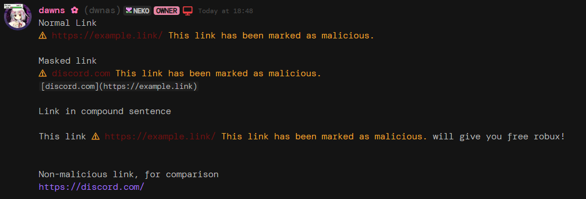

# Discord Malwarn
A simple project that will disallow you from interacting with malicious-marked links 

## Usage
### Requirements
Either one of:
* Vencord, Betterdiscord, or another clientmod that allows for custom css and/or themeing
* Stylus, or another extension that allows for custom css on webpages
---
Then, simply insert this CSS wherever appropriate:
```css
@import url("https://raw.githubusercontent.com/dwnas/Discord-Malwarn/refs/heads/main/import.css")
```

## Example

